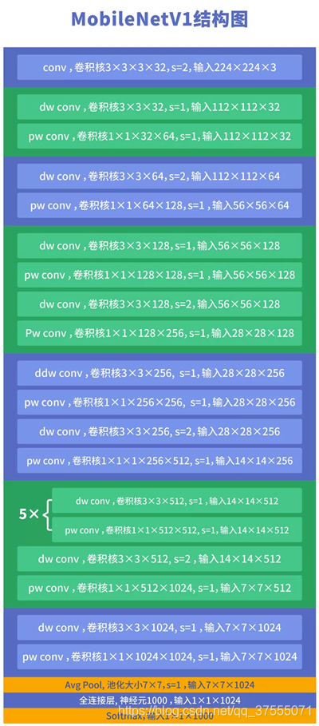
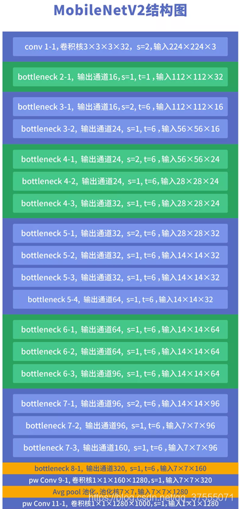
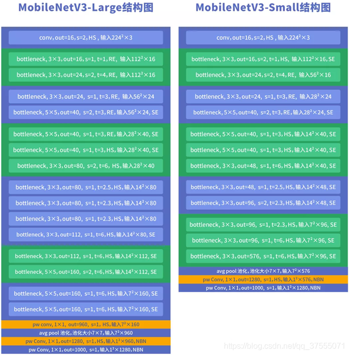

# MobileNet
MobileNetv1,MobileNetv2,MobileNetv3,使用tensorflow2实现

# 网络建构图, [图片来自](https://blog.csdn.net/qq_37555071/article/details/108393809?ops_request_misc=%257B%2522request%255Fid%2522%253A%2522162390848516780262596680%2522%252C%2522scm%2522%253A%252220140713.130102334..%2522%257D&request_id=162390848516780262596680&biz_id=0&utm_medium=distribute.pc_search_result.none-task-blog-2~all~top_positive~default-1-108393809.first_rank_v2_pc_rank_v29&utm_term=MobileNet&spm=1018.2226.3001.4187)
## MobileNetV1  

## MobileNetV2  

## MobileNetV3  

